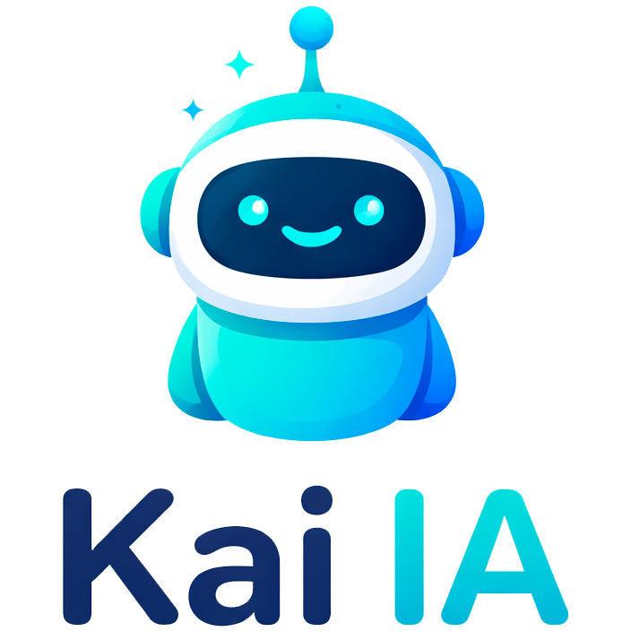

# Inteligencia Artificial Personal

------------------------------------------------------------------------

## 🧠 Descripción

**Kai IA** es un asistente personal inteligente basado en un LLM que integra múltiples servicios como:

-   📧 Gmail
-   📅 Google Calendar
-   📂 Google Drive
-   (Ver en un futuro)

El objetivo del proyecto es crear una **secretaria virtual autónoma** capaz de: 
    - Gestionar correos 
    - Organizar calendarios 
    - Administrar archivos 
    - Automatizar flujos de trabajo 
    - Tomar decisiones basadas en contexto

------------------------------------------------------------------------

## 🏗 Arquitectura

El sistema está compuesto por:

### 🔹 1. LLM

Modelo de lenguaje que: 
    - Interpreta peticiones del usuario 
    - Decide qué servicio utilizar 
    - Genera respuestas estructuradas 
    - Orquesta los microservicios

### 🔹 2. Backend (FastAPI)

El backend esta desarrollado en su totalidad con FastAPI junto con integraciones de Google Cloud para tratar distintas APIs para realizar servicios concretos

### 🔹 3. Integraciones

Uso de: 
    - Google OAuth2
    - Google API Client

### 🔹 4. Frontend

(Aun por elegir)

------------------------------------------------------------------------

## ⚙️ Tecnologías Utilizadas

-   🐍 Python 3.11+
-   ⚡ FastAPI
-   🔗 Google APIs (Drive, Gmail, Calendar)
-   🧠 LLM local (Aun por seleccionar el más óptimo para el proyecto)

------------------------------------------------------------------------

## 📌 Roadmap
-   ✅ Enviar y recibir correos electrónicos en Gmail
-   ⏳ Filtrar correos de diferentes bandejas segun filtros
-   ✅ Extrar hilo de correos electrónicos completos.
-   ✅ Listar archivos de Drive
-   ⏳ Descargar archivos por ID
-   ⏳ Generar URL para descargas de ficheros de Drive
-   ⏳ Subir ficheros a Drive 
-   ⏳ Integración de Calendar
-   ⏳ Leer, crear y modificar entradas de Calendar
-   ✅ Instanciar FastAPI para los Endpoints
-   ⏳ Seleccionar el modelo LLM más óptimo para el contexto
-   ⏳ Seleccionar tecnologías Front, frameworks de CSS y similares
-   ⏳ Pruebas y testing
-   ⏳ Maquetación y generación de Memoria
-   ⏳ Generación de manual de usuario

------------------------------------------------------------------------

## 📄 Licencia

Este proyecto ha sido desarrollado como Trabajo Fin de Grado (TFG) en el Grado en Ingeniería Informática.

El código fuente se proporciona exclusivamente con fines académicos y demostrativos. No se autoriza su uso comercial, distribución o modificación sin el consentimiento expreso del autor. Para solicitudes de uso, colaboración o licenciamiento, contactar directamente con el autor.

---

### 🎨 Recursos gráficos

El logotipo principal (`LOGO.png`) y el icono del proyecto (`icon.png`) han sido creados mediante herramientas de inteligencia artificial generativa, y su uso queda limitado al contexto de este proyecto académico.