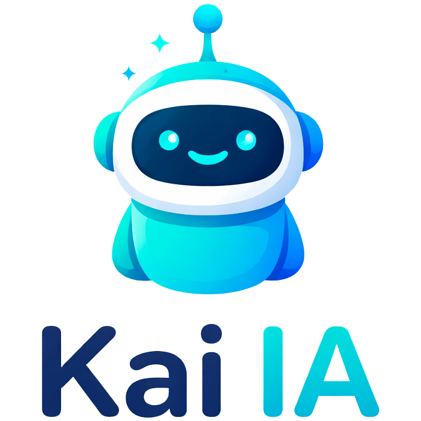

# Kai IA Router Reference

  

  
  
  

This directory contains the FastAPI routers registered by `main.py`. Routers
are intentionally thin: request validation, HTTP errors and response mapping
stay here, while business logic lives in `services`, `core`, `llm` and `tools`.

## Router Groups

| Module | Prefix | Tags | Responsibility |
| --- | --- | --- | --- |
| `app.py` | `/app` | `App` | Desktop bootstrap checks. |
| `auth.py` | `/auth/google` | `Auth` | Google OAuth URL, callback and validation. |
| `calendar.py` | `/calendar` | `Calendar` | Google Calendar operations. |
| `chat.py` | `/assistant` | `Assistant` | Chat, streaming, tools and Debug Lab events. |
| `config.py` | `/config` | `config` | Runtime configuration. |
| `drive.py` | `/drive` | `Drive` | Google Drive file operations. |
| `gmail/__init__.py` | `/gmail` | `Gmail` | Gmail router composition. |
| `gmail/gmail.py` | `/gmail/email-request` | `Email Requests` | Gmail message operations. |
| `gmail/history.py` | `/gmail/history` | `History` | Gmail history tracking. |
| `health.py` | `/health` | `Health` | API health check. |
| `settings.py` | `/settings` | `Settings` | Editable app settings. |
| `tasks.py` | `/tasks` | `Tasks` | Google Tasks operations. |
| `tool_approval.py` | `/assistant/tool` | `Tool Approval` | User approval gate for sensitive tool calls (e.g. shell commands). |

## Endpoint Exposure

The Settings screen includes `expose_service_endpoints`, a runtime switch for
optional direct service routes. When the switch is disabled, Calendar, Drive,
Tasks and non-essential Gmail operation endpoints return `404`. Frontend
required routes stay available, including assistant chat, settings,
authentication, Gmail history checks and single-email reads used by the desktop
notification flow.

## Assistant Routes

| Method | Path | Handler | Purpose |
| --- | --- | --- | --- |
| `POST` | `/assistant/start` | `start` | Create a new chat session. |
| `POST` | `/assistant/chat` | `chat_endpoint` | Run a non-streaming assistant turn. |
| `POST` | `/assistant/ask` | `ask_llm` | Send a direct prompt to the model. |
| `GET` | `/assistant/chats` | `get_chats` | List stored chat sessions. |
| `GET` | `/assistant/chats/{chat_id}` | `get_chat_by_id` | Read one chat with its messages. |
| `POST` | `/assistant/chat/stream` | `assistant_chat_stream` | Stream tokens, debug events and tool results. |
| `POST` | `/assistant/tool/approve/{approval_id}` | `submit_approval` | Submit the user's decision for a pending tool call awaiting approval. |

## Google Workspace Routes

### Gmail

| Method | Path | Purpose |
| --- | --- | --- |
| `POST` | `/gmail/email-request/send` | Send an email. |
| `POST` | `/gmail/email-request/send-with-attachment` | Send an email with uploaded attachments. |
| `GET` | `/gmail/email-request/read/last` | Read recent emails. |
| `GET` | `/gmail/email-request/read/from` | Read emails from a sender. |
| `GET` | `/gmail/email-request/read/subject` | Search by subject. |
| `GET` | `/gmail/email-request/thread/from-message/{message_id}` | Read a thread from a message id. |
| `GET` | `/gmail/email-request/email` | Read a single email by id. |

`/gmail/email-request/email` remains available for the frontend email viewer
when optional service exposure is disabled. The other Gmail operation routes in
this group are protected by the exposure switch.

### Gmail History

| Method | Path | Purpose |
| --- | --- | --- |
| `GET` | `/gmail/history/latest-history-id` | Read the latest Gmail history id. |
| `POST` | `/gmail/history/check` | Check whether Gmail changed. |
| `POST` | `/gmail/history/read` | Read changes since a known history id. |
| `GET` | `/gmail/history/` | List stored history ids. |

The latest, check and read history routes remain available because the desktop
email watcher depends on them. The stored-history listing route is protected by
the exposure switch.

### Calendar

| Method | Path | Purpose |
| --- | --- | --- |
| `GET` | `/calendar/events` | List calendar events. |
| `POST` | `/calendar/events` | Create an event. |
| `GET` | `/calendar/events/{event_id}` | Read an event. |
| `PATCH` | `/calendar/events/{event_id}` | Update an event. |
| `DELETE` | `/calendar/events/{event_id}` | Delete an event. |
| `POST` | `/calendar/freebusy` | Check availability. |
| `POST` | `/calendar/events/meet` | Create a Google Meet event. |

### Drive

| Method | Path | Purpose |
| --- | --- | --- |
| `GET` | `/drive/files` | List files. |
| `GET` | `/drive/files/search` | Search files by name. |
| `POST` | `/drive/upload` | Upload a file. |
| `POST` | `/drive/files/{file_id}/public-link` | Create a public download link. |
| `DELETE` | `/drive/files/{file_id}` | Delete a file. |

### Tasks

| Method | Path | Purpose |
| --- | --- | --- |
| `GET` | `/tasks/tasklists` | List task lists. |
| `POST` | `/tasks/tasklists/ensure` | Find or create a task list. |
| `GET` | `/tasks/tasklists/{tasklist_id}/tasks` | List tasks. |
| `POST` | `/tasks/tasklists/{tasklist_id}/tasks` | Create a task. |
| `GET` | `/tasks/tasklists/{tasklist_id}/tasks/{task_id}` | Read a task. |
| `PATCH` | `/tasks/tasklists/{tasklist_id}/tasks/{task_id}` | Update a task. |
| `DELETE` | `/tasks/tasklists/{tasklist_id}/tasks/{task_id}` | Delete a task. |

## Application Routes

| Method | Path | Purpose |
| --- | --- | --- |
| `GET` | `/app/bootstrap` | Return startup checks for the desktop shell. |
| `GET` | `/auth/google/url` | Return a Google OAuth authorization URL. |
| `GET` | `/auth/google/callback` | Handle Google OAuth callback. |
| `GET` | `/auth/google/test` | Check Google credential usability. |
| `GET` | `/config` | Read configuration. |
| `POST` | `/config` | Write one configuration value. |
| `GET` | `/settings` | Read editable settings. |
| `PUT` | `/settings` | Update editable settings. |
| `GET` | `/health` | Return API health status. |

## Streaming Contract

`POST /assistant/chat/stream` returns Server-Sent Events. The stream can emit:

| Event | Description |
| --- | --- |
| `debug` | Pipeline stage update for Debug Lab. |
| `token` | Incremental assistant output. |
| `done` | Successful completion. |
| `error` | Failed execution. |

Debug stages include `backend_receive`, `tokenize`, `context`,
`lmstudio_request`, `lmstudio_response`, `tool_selected`, `tool_result`,
`token`, `done` and `error`.

## Copyright and License

Copyright (c) 2026 Enrique Padilla Padilla.

Licensed under the Creative Commons Attribution-NonCommercial-ShareAlike 4.0
International License (CC BY-NC-SA 4.0). See [LICENSE](../../LICENSE) for the
full license text.

The Kai IA logo was generated with AI.
