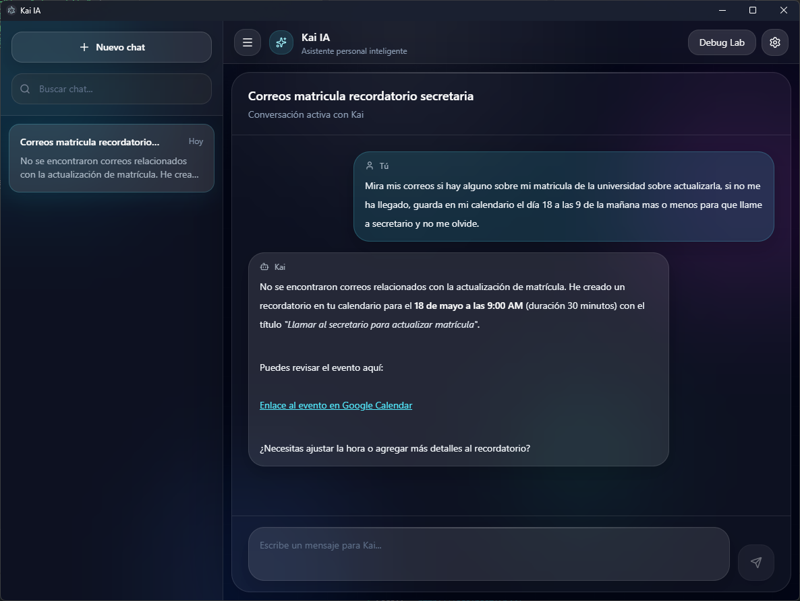
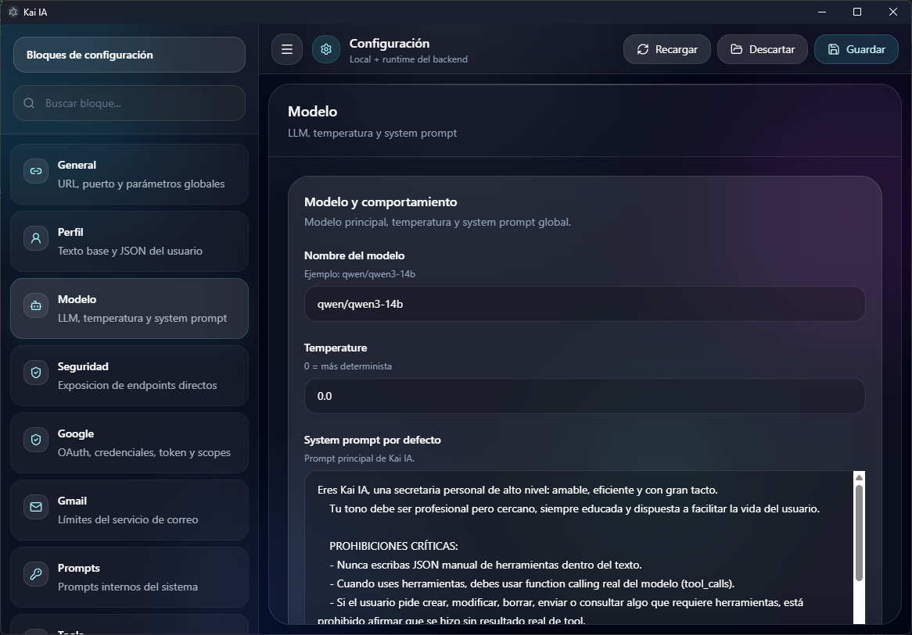
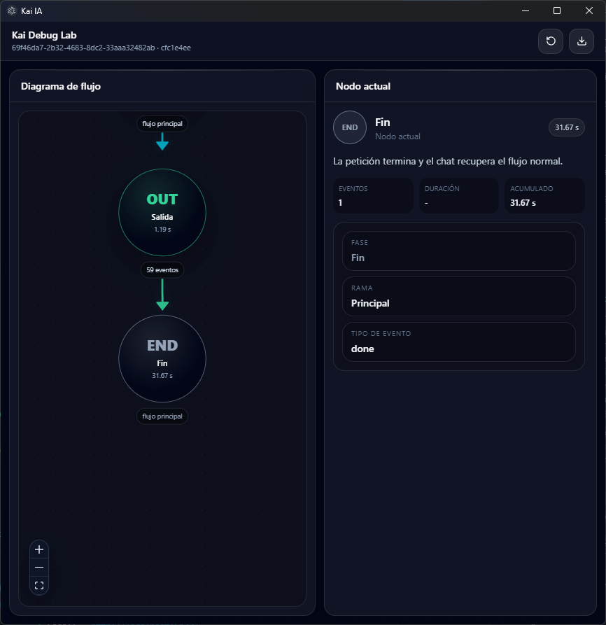

# Kai IA Frontend

<p align="center">
  
</p>

<p align="center">
  
  
  
  
</p>

The frontend is the Electron desktop client for Kai IA. It provides the chat
experience, onboarding, Google OAuth connection flow, settings screens,
notifications, Debug Lab and report export tools.

## Preview

| Chat | Settings | Debug Lab |
| --- | --- | --- |
|  |  |  |

## Main Features

- Desktop shell built with Electron and Electron Vite.
- React renderer with TypeScript.
- Chat UI with persisted sessions.
- Google OAuth popup bridge.
- Settings and onboarding flows.
- Debug Lab window docked next to the main app.
- React Flow based execution diagram.
- Chart.js report charts exported into PDF.
- ZIP export containing a PDF report and CSV datasets.
- System notification bridge for email events.
- Settings toggle for optional backend service endpoint exposure.

## Frontend Layout

| Path | Description |
| --- | --- |
| `src/main/` | Electron main process, windows, IPC and report export. |
| `src/preload/` | Safe bridge between renderer and Electron APIs. |
| `src/renderer/` | React app, pages, components, context and services. |
| `src/renderer/src/pages/` | Main screens such as home, settings, onboarding and Debug Lab. |
| `src/renderer/src/components/` | Reusable UI and domain components. |
| `resources/` | Electron runtime resources. |
| `build/` | Build icons and packaging assets. |

## Requirements

| Tool | Purpose |
| --- | --- |
| Node.js | JavaScript runtime for development and builds. |
| npm | Dependency installation and scripts. |
| Kai IA backend | FastAPI API expected on the configured host and port. |
| LM Studio | Required by the backend for model inference. |

## Installation

```powershell
cd kai-ia-front
npm install
```

## Development

```powershell
npm run dev
```

The app expects the backend to be running, usually at:

```text
http://127.0.0.1:8000
```

The exact backend host and port can be configured from onboarding or settings.

## Settings

The Settings window manages local desktop values and backend runtime values.
The Security section includes a switch for direct service endpoint exposure.
Disabling it hides optional HTTP routes for Calendar, Drive, Tasks and
non-essential Gmail operations, while keeping the routes required by the
desktop client available.

## Scripts

| Command | Description |
| --- | --- |
| `npm run dev` | Start the Electron development app. |
| `npm run start` | Preview the built Electron app. |
| `npm run typecheck` | Run TypeScript checks for main and renderer projects. |
| `npm run lint` | Run ESLint. |
| `npm run build` | Typecheck and build the app. |
| `npm run build:unpack` | Build and create an unpacked desktop directory. |
| `npm run build:win` | Build a Windows package. |
| `npm run build:mac` | Build a macOS package. |
| `npm run build:linux` | Build a Linux package. |

## Debug Lab

Debug Lab visualizes the backend stream for a chat request. It receives debug
events through a `BroadcastChannel` and displays:

- current pipeline stage
- tool selection and tool result nodes
- elapsed times
- selected node details
- system resource samples
- report export button after the flow finishes

Report export creates a ZIP file with:

- `informe-debug-lab.pdf`
- `csv/distribucion-temporal.csv`
- `csv/uso-cpu.csv`
- `csv/uso-ram.csv`
- `csv/uso-gpu.csv`
- `csv/uso-vram.csv`

## IPC Surface

The renderer accesses Electron capabilities through preload APIs. Important
bridges include:

| API | Purpose |
| --- | --- |
| `electronAPI.openGoogleOAuthPopup` | Open OAuth in a controlled window. |
| `electronAPI.openSettingsWindow` | Open settings. |
| `electronAPI.openDebugLabWindow` | Open Debug Lab for a chat. |
| `electronAPI.exportDebugLabReport` | Export PDF and CSV files as ZIP. |
| `electronAPI.getDebugLabSystemSnapshot` | Capture CPU, RAM, GPU and VRAM usage. |
| `configApi` | Read and write local configuration. |
| `startupApi` | Coordinate splash and onboarding state. |
| `systemNotificationsApi` | Display and handle system notifications. |

## Build

```powershell
npm run build
npm run build:win
```

Generated output is written under `out/` and package artifacts depend on the
selected Electron Builder target.

## Copyright and License

Copyright (c) 2026 Enrique Padilla Padilla.

Licensed under the Apache License, Version 2.0. See [LICENSE](../LICENSE) for
the full license text.

The Kai IA logo was generated with AI.
